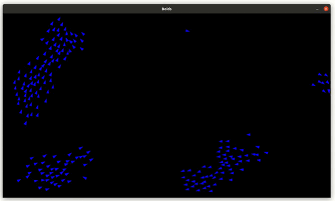

# Boids


## Introduction
Boids is an algorithm developped by Craig W. Reynolds to portray the movement of flocks of birds, or schools of fish. 

This algorithm relies on 3 rules that define the behavior of each boid : 
- cohesion : boids go towards the center of the flock
- alignment : boids align themselves with each other
- separation : boids stay away from each other to avoid collision

## Running the simulation
To start using this repo, install pygame and numpy.
```bash
pip install requirements.txt
```
The simulation can then be started by running main.py with python.
```python
python3 main.py
```

## About this repo
This implementation of boids runs using pygame, a python library for game develoment.

Computations are optimized by using matrix operations with numpy instead of iterating over all boids. This enables us to run simulations with over 200 boids at 60 FPS, instead of being limited to ~40 boids.
